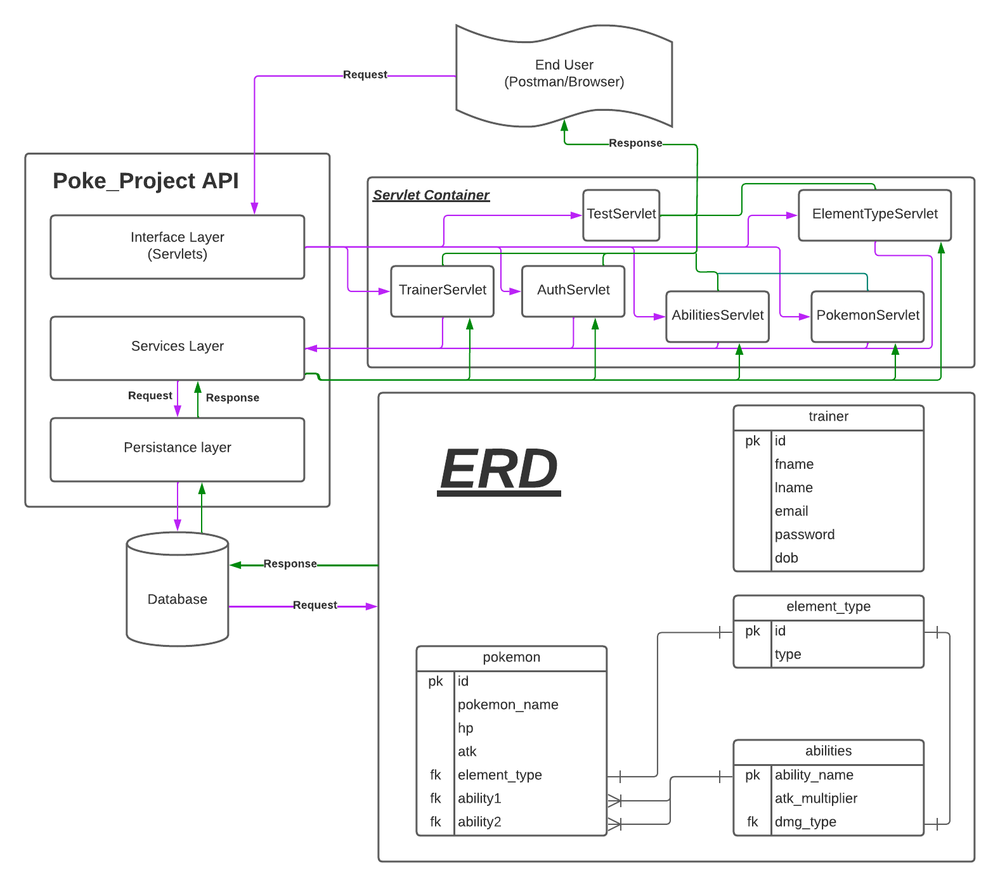

# Welcome to the Ross Bank Corporation

## Description

Bank for all users from all side of the World!
## User Story

- [ ] As a new bankUser, I should be able to register myself on the system, so that I can begin using the RossBank project application.
- [ ] As a bankUser, I should be able to log in once I've registered so that I can access the information in the database about all the known RossBankmon.

## Tech Stack

- Java 8 JDK
- Apache Maven 3
- Tomcat 10 Servlets
- Local PostgreSQL (eventually hosted on Azure)
- Git SCM (GitHub)
- HTML/CSS/JS

## Installation

- Currently the application only requires that you have Java 8, a postgresql database and maven installed on your system.
- Pull down the git repository with the following commands

```bash
# Follow these steps to build the API from the CLI
git 
cd 

git 

# Generate a db.properties file and fill out the appropriate information for
# you database. Fill after each "=" the according information.
printf "url=\nuser=\npassword=\n" > src/main/resources/db.properties
```

- Next make sure to run the RossBank-script.sql script file in the src/main/resources directory to obtain all the appropriate tables. Note: make sure you're working within the appropriate schema for you database.
- Finally, boot up the java application and use the MainDriver to access the menus that allow for requests to be made to the databse.

## Project Structure

# Seyedrasool_Sadrieh_p0
